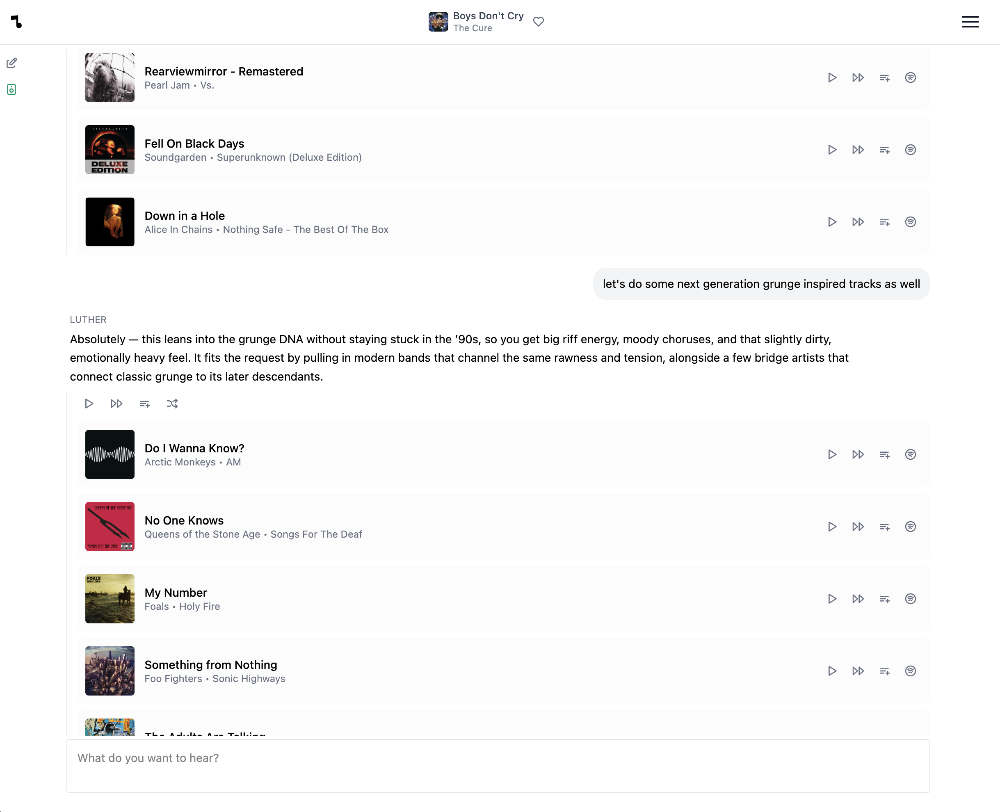

# Listen to Luther

Spotify's AI DJ X is nice enough...if you want an entirely passive listening
experience. If you want an interactive experience, Listen to Luther instead!

Luther lives at [listentoluther.com](https://listentoluther.com).

Set the following environment variables in `.env`:

```
SPOTIFY_CLIENT_ID=your-spotify-app-client-id
SPOTIFY_CLIENT_SECRET=your-spotify-app-client-secret

OPENAI_API_KEY=your-openai-api-key

# there are a bunch of other vars luther needs to run in 
# production, but you can set this to skip almost all of those:

PROUCTION=false
```

Run the server:

```
deno task start
```


