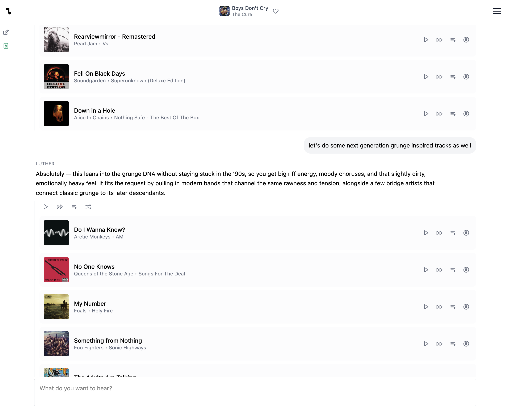

# Listen to Luther

Spotify's AI DJ X is nice enough...if you want a very repetitive listening
experience. If you want more control, Listen to Luther instead!

Luther lives at [listentoluther.com](https://listentoluther.com).

Set the following environment variables in `.env`:

```
SPOTIFY_CLIENT_ID=your-spotify-app-client-id
SPOTIFY_CLIENT_SECRET=your-spotify-app-client-secret

OPENAI_API_KEY=your-openai-api-key
NEON_DATABASE_URL=your-neon-postgres-connection-string
NEON_AUTH_URL=https://ep-xxx.neonauth.c-2.us-east-2.aws.neon.tech/neondb/auth
NEON_DATA_API_URL=https://ep-xxx.apirest.c-2.us-east-2.aws.neon.tech/neondb/rest/v1
```

Run the server:

```
deno task dev
```


